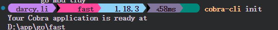
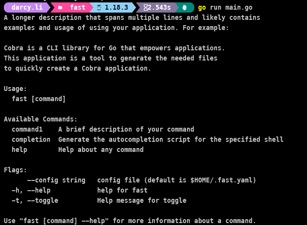
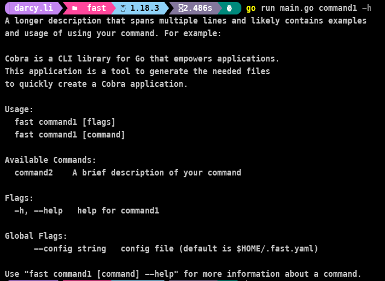

# fast template

## viper处理配置文件

### 配置文件

通过`--config`全局参数可以指定配置文件，默认为~/.config.yaml。

```go
    if cfgFile != "" {
		// Use config file from the flag.
		viper.SetConfigFile(cfgFile)
	} else {
		// Find home directory.
		home, err := os.UserHomeDir()
		cobra.CheckErr(err)

		// Search config in home directory with name ".fast" (without extension).
		viper.AddConfigPath(home)
		viper.SetConfigType("yaml")
		viper.SetConfigName(".fast")
	}
```

### 默认值

`initViperDefault` 设置viper的默认值，利用`generate`command可以根据默认值产生配置文件。

```go
func initViperDefault() {
	name := os.Args[0]
	name = filepath.Base(name)
	name = strings.Replace(name, filepath.Ext(name), "", 1) // 取运行程序的名称
	viper.SetDefault("logdir", "./")                        // 日志目录
	viper.SetDefault("logname", name)                       // 日志名称
	viper.SetDefault("loginterval", "day")                  // 日志名称
}
```

## cobra处理命令行参数

### cobra-cli

> 如果你需要使用cli生产参数命令，请安装cobra-cli，`go install github.com/spf13/cobra-cli@latest`

> 你也可以直接修改代码使用cobra，不需要安装cobra-cli

#### 初始化参数



+ 删除 cmd目录和目录下所有文件，运行命令`cobra-cli init`，重新产生所有cmd命令，运行`go run main.go`查看运行结果

> 运行前，请记得初始化项目`go mod init youapp`

#### 增加参数

+ `cobra-cli add command1` 可以增加一个顶层参数
+ `cobra-cli add command2 -p command1Cmd` 为command1增加一个子参数

> `command1Cmd`是参数command1的项目中的实际值


> 运行结果





#### 进阶使用

请看cobra-cli作者[说明文档](https://github.com/spf13/cobra-cli/blob/main/README.md)

### cobra

#### 为command添加flag


```go
generateFile = generateCmd.Flags().StringP(
		"file", "f", filepath.Join(home, ".fast.yaml"),
		`指定文件名，默认为~/.fast.yaml。
允许的后缀名为`+supportExt()+`，如果无后缀名或不在允许范围，会自动增加后缀.yaml。
如果指定目录，未指定文件名，默认文件名为.fast.yaml。`)
```